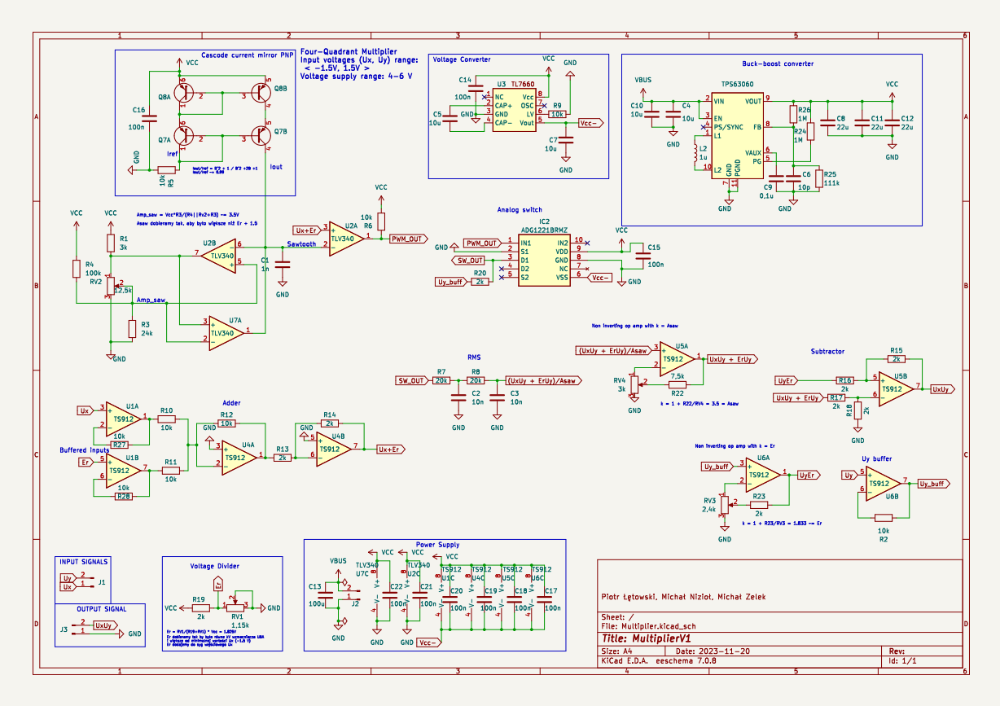

# Multiplier
Project of four quadrant multiplier for Systems and Electronics Circuits subject
---
## Project description
* Power Supply: (4V - 6V) DC
* Input signals range: (-1.5V - 1.5V) DC/AC
* PCB dimensions: 60x30mm 
* PCB components size: 0805
---

